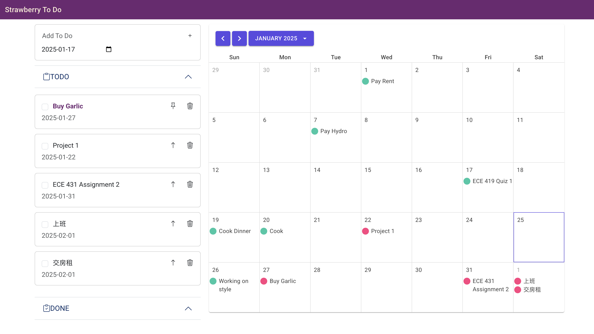

# Blazor To Do Front-end

## Overview
This project is a Blazor-based ToDo application frontend that provides users with a clean and interactive interface for managing tasks. It is built using Blazor server and integrates CSS for styling. This README serves as a guide to set up, understand, and contribute to the project.

## Features
- Add, update, pin, and delete tasks.
- View task deadlines in an calendar.
- Responsive design for different screen sizes.
- Integration with a backend service for data persistence.

## Preview
A demo of the web:


## Project Structure
```
├── bin/                        # Build output (ignored in GitHub)
├── Clients/                    # Client-side service for interacting with backend APIs
│   └── TodoClient.cs           # Handles API calls for ToDo items
├── Components/                 # Reusable UI components
│   ├── Layout/                 # Layout-related components
│   │   ├── MainLayout.razor
│   │   └── NavMenu.razor
│   └── ...                     # Additional components
├── Pages/                      # Pages of the application
│   ├── Home.razor              # Homepage
│   ├── AddTodo.razor           # Add ToDo functionality
│   └── ...                     # Additional pages
├── Models/                     # Data models for the application
│   ├── TodoItem.cs             # Represents a ToDo item
│   └── CustomCalendarItem.cs   # Custom calendar data model
├── wwwroot/                    # Static files (CSS, JS, images)
│   ├── bootstrap/              # Bootstrap assets
│   ├── app.css                 # Custom styling
├── Properties/                 # Application settings
│   └── launchSettings.json
└── ...                         # Other folders and files
```

## Prerequisites
To run and develop the project, you need the following:
- .NET 8.0 or higher
- A code editor like Visual Studio Code or Visual Studio

## Getting Started

### Clone the Repository
```bash
git clone <repository-url>
cd BlazorToDoFrontend
```

### Build and Run
1. Restore dependencies:
   ```bash
   dotnet restore
   ```

2. Run the application:
   ```bash
   dotnet run
   ```

3. Open your browser and navigate to `https://localhost:5081`.

## Customizing Styles
- CSS variables or custom styles are defined in `wwwroot/app.css`.
- To add global styles, include them in `wwwroot/app.css`.
- For component-specific styles, use `.razor.css` files (e.g., `MainLayout.razor.css`).

## API Integration
- The project uses `TodoClient.cs` to interact with a backend API. Update the API base URL in `TodoClient.cs` to match your backend server.
- Http requset server address `httpClientAddress` is defined in `appsettings.json`. Update the address to match your backend server.

## Contributing
### Branching Strategy
1. Create a new branch for your feature or bug fix:
   ```bash
   git checkout -b feature/your-feature-name
   ```
2. Commit your changes:
   ```bash
   git commit -m "Add your message here"
   ```
3. Push your changes:
   ```bash
   git push origin feature/your-feature-name
   ```
4. Submit a pull request for review.

### Code Style
- Follow C# conventions and use meaningful variable and function names.
- Keep components modular and reusable.

## License
This project is licensed under the MIT License. See `LICENSE` for details.

## Acknowledgments
- [Blazor Documentation](https://learn.microsoft.com/en-us/aspnet/core/blazor/)
- [Bootstrap](https://getbootstrap.com/) and [MudBlazor](https://mudblazor.com/) for UI styling.

---
Feel free to contribute, open issues, or submit feature requests. Happy coding!

